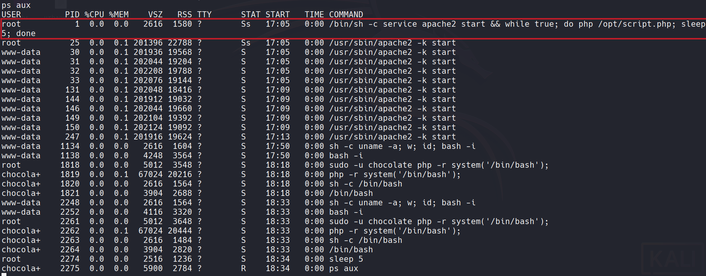

# Info
## IP Víctima
```
172.17.0.2
```
# Writeup

## Reconocimiento
### Nmap
En primer lugar hago un escaneo de puertos como de costumbre con el objetivo de identificar los puertos abiertos y los servicios que corren en ellos. No hay más que un servidor HTTP en el puerto 80 así que habrá que echarle un ojo a la página web.


### Nibbleblog
Nada más aterrizar la página solo nos muestra la página default de Apache2, así que voy a fuzzear en busca de directorios ocultos para ampliar un poco la superficie de ataque. Tras probar un rato de fuzzing y no encontrar nada que pueda suponer un avance, inspecciono el código fuente en busca de información interesante, y me encuentro con este comentario que parece ser un directorio.


Al visitarlo, me encuentro con una página de confirmación de la instalación de Nibbleblog, que al parecer es un motor de creación de blogs que corre en PHP, hay un enlace a un login de administrador en el que quiero probar varias cosas para ver si se puede romper de alguna forma, mientras tanto voy a dejar un nuevo fuzzing corriendo sobre este directorio.
Con el fuzzing no encuentro mucho más que los archivos y directorios por defecto del motor, así que paso a probar SQLi y algunas credenciales, hasta conseguir entrar simplemente con `admin` y `admin`. 
## Explotación
### CVE-2015-6967
Investigando un poco llego a la vulnerabilidad [CVE-2015-6967](https://nvd.nist.gov/vuln/detail/CVE-2015-6967), que afecta a Nibbleblog en las versiones previas a la 4.0.5 (este sitio está en la 4.0.3), una vulnerabilidad en el plugin MyImage permite la subida de archivos PHP. Aprovechando mi condición de admin, instalo el plugin y subo una reverse shell en php (la de Pentest Monkey, sacada de https://www.revshells.com/), una vez hecho esto, solo queda acceder al archivo desde `content/private/plugins/my_image/`, tal y como pone en el artículo del NIST citado tres líneas más arriba. 


## Post explotación
Una vez estamos dentro como www-data, sanitizamos la shell, después lanzamos un sudo -l para ver que comandos podemos ejecutar y vemos que php puede ser ejecutado como el usuario chocolate.


Con esta información en mente, hacemos una búsqueda en GTFObins y pivotamos al usuario chocolate con:
```
CMD="/bin/bash"
```
```
sudo -u chocolate php -r "system('$CMD');"
```

Una vez ya somos chocolate, con un `ps aux` podemos ver los procesos del sistema, y nos encontramos con un script en `/opt` que se ejecuta como root cads 5 segundos,



Vamos a aprovechar este vector de escalada para ganar una shell como root, utilizando `echo` combinado con el operador `>` vamos a sobreescribir el contenido del archivo sobre el cual tenemos permisos de escritura en `/opt/script.php` modificando el código para que cuando este se ejecute, añadir el bit SUID al binario `/bin/bash`. Esto lo haremos con el siguiente código:

```php
echo '<?php system("chmod u+s /bin/bash"); ?>' > /opt/script.php
```

Es decir, vamos a hacer que dicho binario (en este caso la shell), se ejecute con los permisos de su propietario (root).

Después de esperar 5 segundos para asegurar que se ejecuta, comprobamos si ha funcionado lanzando un `ls -la /bin/bash`, y vemos que sí, ahora ya podemos entrar a una shell como root con `bash -p` (muy importante añadir el flag `-p` para que los permisos del propietario se hereden y ser root, de lo contrario seguiríamos siendo chocolate).


