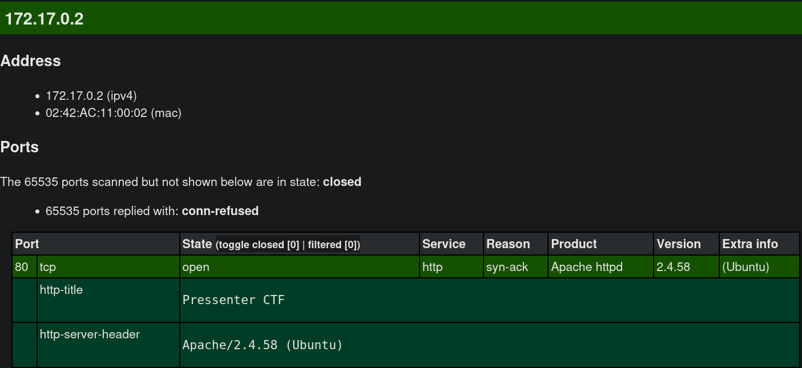
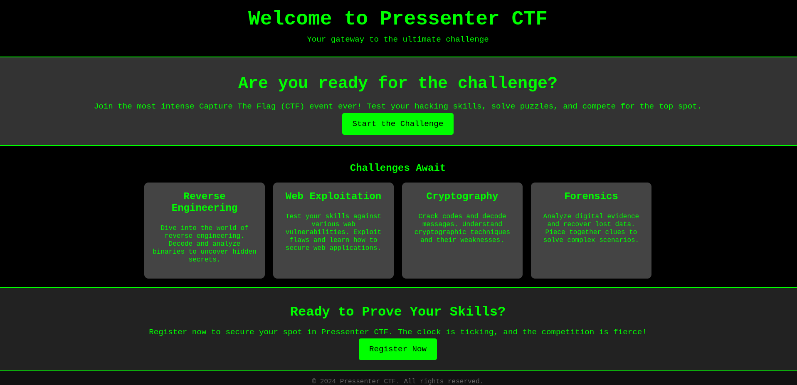
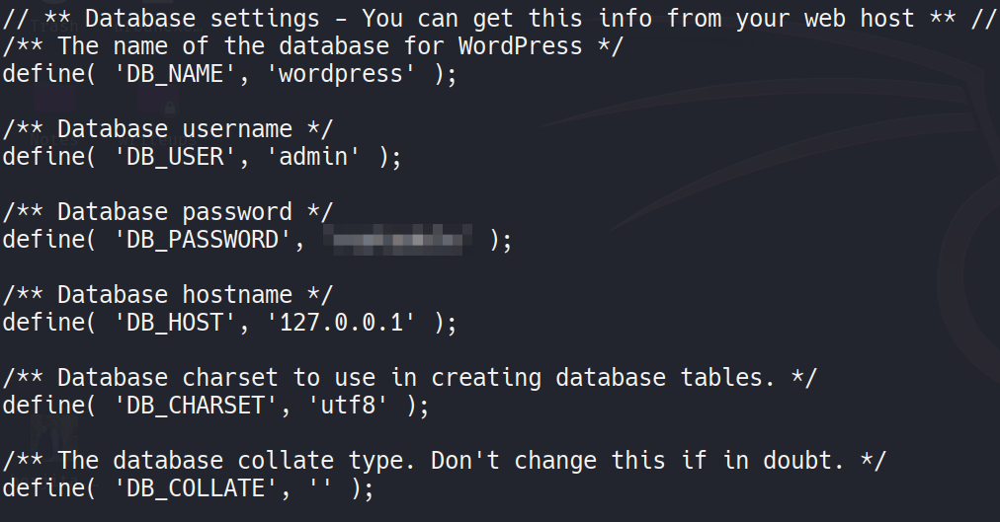

# Pressenter
## Reconocimiento

Comienzo por escanear los puertos de la aplicación
```
❯ nmap -p 0-65535 --open -T5 -A -sT -Pn -n 172.17.0.2 -oX nmapScan.xml && xsltproc nmapScan.xml -o nmapScan.html && open nmapScan.html &>/dev/null & disown
```
El resultado no revela nada más que un servidor HTTP, por lo que no queda otra que visitar la página.





La página es una especie de reto(s) de CTFs, solo hay un enlace funcional y es el de registro, que lleva a un panel de registro de atrezzo, como el propio texto sobre él indica.
Un poco más abajo veo que debo dirigirme al dominio pressenter.hl, así que modifico el archivo `/etc/hosts` (en mi caso con `nvim /etc/hosts`) para añadir el dominio y asignarlo a la IP del lab.


Al visitar este dominio me encuentro con una página de una firma de arquitectura hecha en WordPress, después de echar un ojo veo un artículo titulado "Las aventuras de pressi y su fiel hacker" y aparentemente no gran cosa, lo lógico es utilizar wpscan para obtener más información.


Enumero plugins
```
❯ wpscan --url http://pressenter.hl/ -e p --api-token OoIxdRfsL8IrVkt83hgCQbnvVMi0CHTPWscKVi1sXzc
```
Temas vulnerables
```
❯ wpscan --url http://pressenter.hl/ -e vt --api-token OoIxdRfsL8IrVkt83hgCQbnvVMi0CHTPWscKVi1sXzc
```
Y usuarios
```
❯ wpscan --url http://pressenter.hl/ -e u --api-token OoIxdRfsL8IrVkt83hgCQbnvVMi0CHTPWscKVi1sXzc
```
## Explotación

El único análisis que me da resultados relevantes es el de usuarios, que me recupera dos; `pressi` y `hacker`. A falta de más información probaré a atacar mediante diccionario.

```
❯ wpscan --url http://pressenter.hl/ -U pressi -P /usr/share/wordlists/rockyou.txt
```

El ataque da resultados y encuentra claves para el usuario `pressi`.


Una vez dentro como `pressi`, instalo el plugin File Manager, con el creo una carpeta nueva en la raíz llamada `dev`, dentro creo un archivo llamado `shell.php` y escribo en él la revshell de PHP de PentestMonkey, entonces, me pongo en escucha en mi consola y al acceder a pressenter.hl/dev/shell.php gano acceso en mi consola a la máquina como `www-data`.
## Post-explotación

Lo primero siempre es sanitizar la shell


Examinando los archivos de config de WordPress encuentro las claves de acceso a la DB



Con `mysql -u admin -p` e introduciendo la contraseña encontrada en la config usamos comandos de SQL para sacar la contraseña del usuario enter.


Probando con esa misma clave se puede llegar a root

