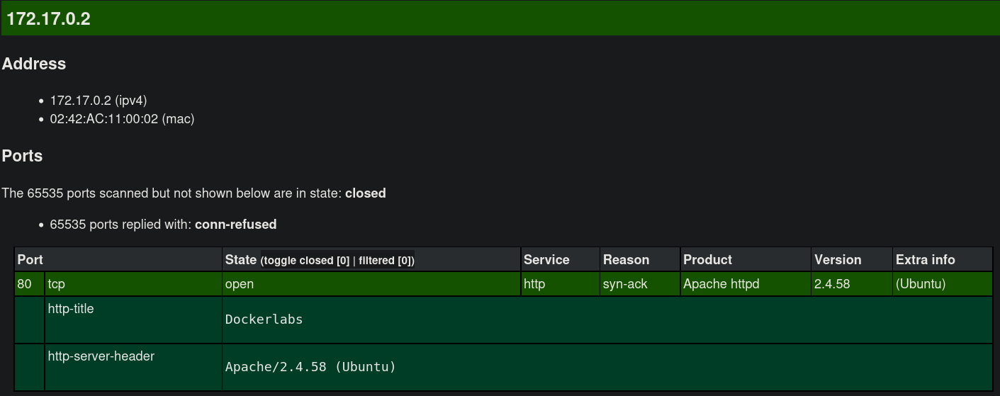
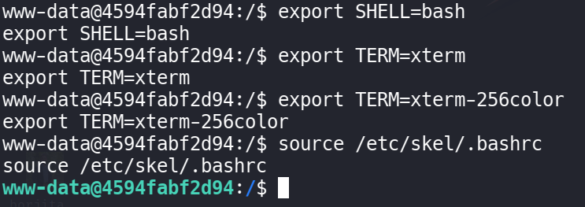
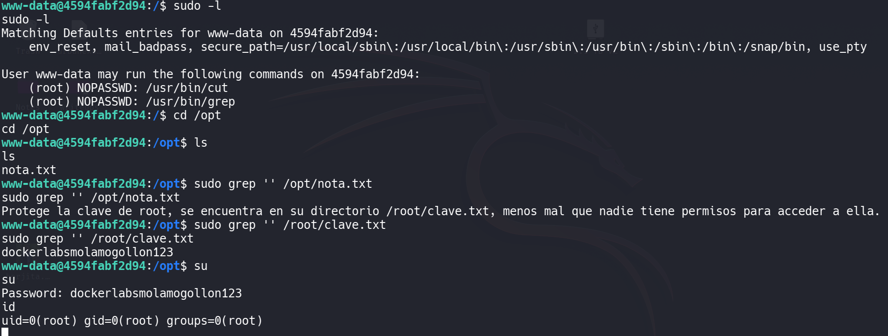

# DockerLabs
## Reconocimiento
En primer lugar escaneo los puertos con `nmap`
```
❯ nmap -p 0-65535 --open -T5 -A -sT -Pn -n 172.17.0.2 -oX nmapScan.xml && xsltproc nmapScan.xml -o nmapScan.html && open nmapScan.html &>/dev/null & disown
```
Hay solo un servidor HTTP, por lo que el siguiente paso va a ser visitar la página.



Es un imitación de la página de Dockerlabs, con sus laboratorios, dificultades, buscador... 


Después de realizar fuzzing con `gobuster`
```
❯ gobuster dir -u 'http://172.17.0.2/' -w /usr/share/wordlists/seclists/Discovery/Web-Content/directory-list-2.3-medium.txt -x php,html,js,txt,db,config,xml,py,bak,conf,java,jar,python -o fuzzing.txt
```
Doy con un directorio interesante, llamado `/machine.php`, que permite la subida de archivos. Al intentar subir mi archivo `shell.php`, la página muestra el siguiente mensaje: "No se permite la subida de archivos que no sean .zip".
## Explotación
Después de probar varias extensiones y otros métodos durante un rato, puedo subir el archivo malicioso con la extensión `.phar`, una vez hecho esto, voy a `/uploads`, me pongo en escucha en una terminal con `nc -nvlp 443` y clico en el archivo que acabo de subir, ganando una shell como www-data.
## Post explotación
Lo primero es sanitizar la shell.



Al hacer `sudo -l` veo que puedo ejecutar `grep` como root, después de echar un ojo por la máquina encuentro un archivo en la ruta `/opt/nota.txt`, lo leo con `grep` y veo que indica la ruta a un archivo que contiene la contraseña de root, lo leo de nuevo usando `grep` y ya tengo credenciales para autenticarme como root.

